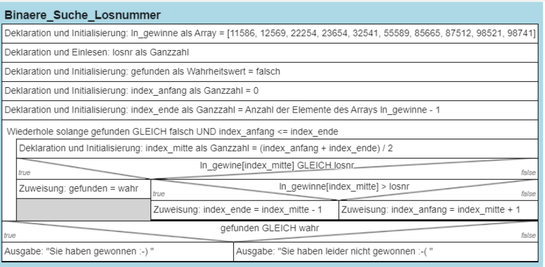
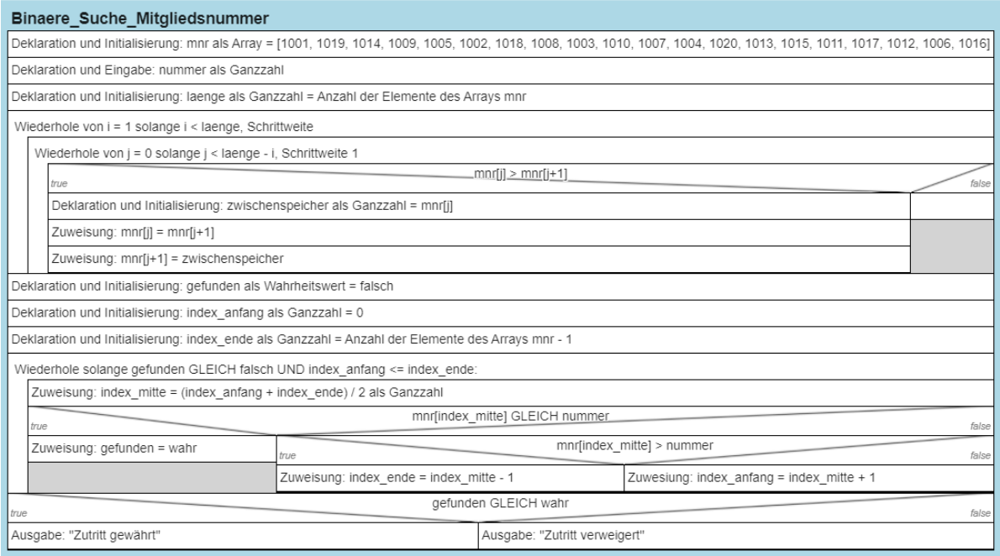
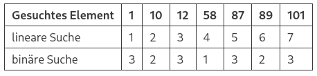

# Aufgabe 1: Binäre Suche - Losnummer


Sie erhalten den Auftrag ein Programm zu entwickeln, das dem Benutzer
zurückgibt, ob seine Losnummer gewonnen hat. Die Losnummern der
Gewinnlose sind bereits in einem Array `ln_gewinne` implementiert.

Die Losnummern der Gewinnlose sind bereits in einem Array `ln_gewinne`
implemwntiert.

`ln_gewinne = [11586, 12569, 22254, 23654, 32541, 55589, 85665, 87512, 98521, 98741]`

Nachdem der Benutzer seine Losnummer eingegeben hat, ist mit Hilfe der
binären Suche zu prüfen, ob diese Losnummer unter den Gewinnlosen ist.
Ist dies der Fall, so soll die Meldung “Sie haben gewonnen :-)”, im
anderen Fall “Sie haben leider nicht gewonnen :-(” ausgegeben werden.

``` python
ln_gewinne = [11586, 12569, 22254, 23654, 32541, 55589, 85665, 87512, 98521, 98741]

losnr = int(input("Gesuchte Losnummer:"))
gefunden = False
index_anfang = 0
index_ende = len(ln_gewinne)-1

while gefunden == False and index_anfang <= index_ende:
    index_mitte = int((index_anfang + index_ende) / 2)
        
    if ln_gewinne[index_mitte] == losnr:
        gefunden = True
    elif ln_gewinne[index_mitte] > losnr:
        index_ende = index_mitte - 1
    else:
        index_anfang = index_mitte + 1

if gefunden:
    print("Sie haben gewonnen :-)")
else:
    print("Sie haben leider nicht gewonnen :-(")
```

<figure>

<figcaption aria-hidden="true">image.png</figcaption>
</figure>

# Aufgabe 2: Binäre Suche – Mitgliedsnummer

Mit der Aufgabenstellung aus “Lineare Suche Mitgliedsnummer” wurde
bereits eine Lösung mit Hilfe der linearen Suche erarbeitet.  
In dieser Aufgabenstellung soll nach der Eingabe einer Mitgliedsnummer
mit Hilfe der **binären Suche** geprüft werden, ob die eingegebene
Nummer existiert. Alle vergebenen Mitgliedsnummern des Vereins sind im
Array `mnr` erfasst.

`mnr =  [1001, 1019, 1014, 1009, 1005, 1002, 1018, 1008, 1003, 1010, 1007, 1004, 1020, 1013, 1015, 1011, 1017, 1012, 1006, 1016]`

Wird die eingegebene Mitgliedsnummer gefunden, soll die Meldung „Zutritt
gewährt“ ausgegeben werden. Wird die Nummer nicht gefunden, soll die
Meldung „Zutritt verweigert“ erscheinen.

``` python
#Mitgliedsnummern
mnr = [1001, 1019, 1014, 1009, 1005, 1002, 1018, 1008, 1003, 1010, 1007, 1004, 1020, 1013, 1015, 1011, 1017, 1012, 1006, 1016]

#Eingabe
nummer = int(input("Mitgliedsnummer eingeben: "))
laenge = len(mnr)

#Sortieurng mit Bubble Sort
for i in range(1, laenge):
    for j in range(0, laenge-i):
        if mnr[j] > mnr[j+1]:
            zwischenspeicher = mnr[j]
            mnr[j] = mnr[j+1]
            mnr[j+1] = zwischenspeicher

# Binäre Suche
gefunden = False
index_anfang = 0
index_ende = len(mnr)-1

while gefunden == False and index_anfang <= index_ende:
    index_mitte = int((index_anfang + index_ende) / 2)
        
    if mnr[index_mitte] == nummer:
        gefunden = True
    elif mnr[index_mitte] > nummer:
        index_ende = index_mitte - 1
    else:
        index_anfang = index_mitte + 1

#Ausgabe
if gefunden:
    print("Zutritt gewährt")
else:
    print("Zutritt verweigert")
```

<figure>

<figcaption aria-hidden="true">image.png</figcaption>
</figure>

# Aufgabe 3:

Gegeben ist folgendes Array `[10, 12, 8, 11, 3, 15, 5, 1, 2]` \###
Aufgabe 3.1 Nach wie vielen Vergleichen wird die Zahl 2 im Array mit der
linearen Suche gefunden?

``` python
Die Zahl 2 wird nach neun Vergleichen gefunden.
```

### Aufgabe 3.2

Nennen Sie die Voraussetzung für die Anwendung der binären Suche und
bearbeiten Sie das Array entsprechend.

``` python
Voraussetzung für die Anwendung der binären Suche ist ein sortiertes Array.

Sortiertes Array = [1, 2, 3, 5, 8, 10, 11, 12, 15]
```

### Aufgabe 3.3

Wie viele Vergleiche benötigt die binäre Suche, bis die Zahl 2 in
folgendem Array gefunden wird?

Sortiertes Array = \[1, 2, 3, 5, 8, 10, 11, 12, 15\]

``` python
Das gesuchte Element wird nach zwei Vergleichen gefunden
```

### Aufgabe 3.4

Gegeben ist das Array `[1, 10, 12, 58, 87, 89, 101]`.

Tragen Sie in die nachfolgende Tabelle die Anzahl der Vergleiche ein,
bis in dem gegebenen Array das gesuchte Element mit Hilfe der linearen
Suche bzw. der binären Suche gefunden wurde.

<table>
<thead>
<tr class="header">
<th>Gesuchtes Element</th>
<th>1</th>
<th>10</th>
<th>12</th>
<th>58</th>
<th>87</th>
<th>89</th>
<th>101</th>
</tr>
</thead>
<tbody>
<tr class="odd">
<td>lineare Suche</td>
<td></td>
<td></td>
<td></td>
<td></td>
<td></td>
<td></td>
<td></td>
</tr>
<tr class="even">
<td>binäre Suche</td>
<td></td>
<td></td>
<td></td>
<td></td>
<td></td>
<td></td>
<td></td>
</tr>
</tbody>
</table>

<figure>

<figcaption aria-hidden="true">image.png</figcaption>
</figure>
