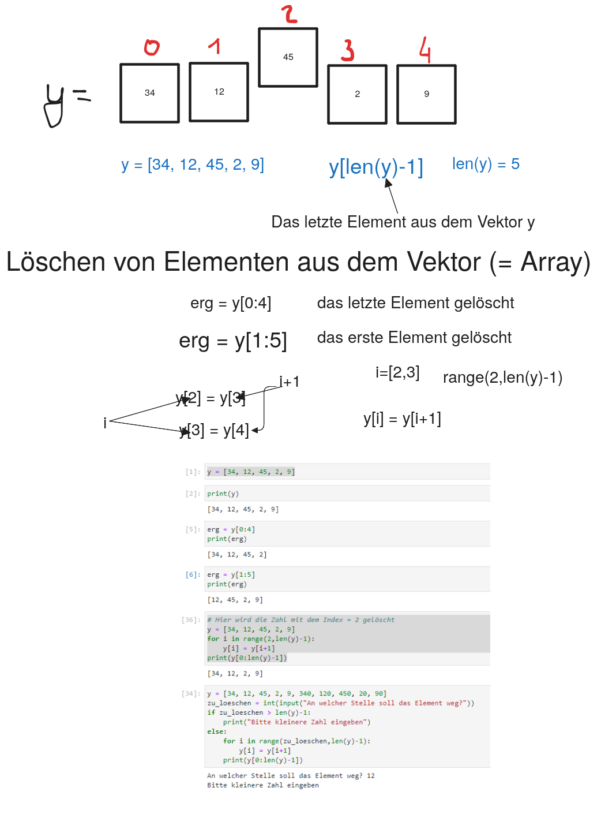

# Inhalte aus dem Array entfernen


<figure>

<figcaption aria-hidden="true">grafik.png</figcaption>
</figure>

# Aufgabe 1

Erstellen Sie einen Zahlenvektor mit den Zahlen \[23, 15, 17, 12, 100,
35, 67\]

1.  Löschen Sie das letzte Element aus dem Vektor
2.  Löschen Sie das erste Element aus dem Vektor
3.  Löschen Sie ein Element aus der Mitte

``` python
zahlen =  [23, 15, 17, 12, 100, 35, 67]
erg = zahlen[0:len(zahlen)-1]
print(erg)
```

    [23, 15, 17, 12, 100, 35]

``` python
zahlen =  [23, 15, 17, 12, 100, 35, 67]
erg = zahlen[1:len(zahlen)]
print(erg)
```

    [15, 17, 12, 100, 35, 67]

``` python
zahlen =  [23, 15, 17, 12, 100, 35, 67]
for i in range(2,len(zahlen)-1):
    zahlen[i] = zahlen[i+1]
erg = zahlen[0:len(zahlen)-2]
print(erg)
```

    [23, 15, 12, 100, 35]

# Aufgabe 2

Die Software des Trainers der Abteilung Volleyball des Sportvereines
Mühlberger SC enthält ein Array mit allen Spielernamen des
Mannschaftskaders.  
`kader =[Armin", "Batu", "Kai", "Sven", "Paul", "Milan", "Goran", "Chris", "Nico","Dennis", "Emin", "Luca"]`  
Mit Hilfe der Software soll es möglich sein, den Spieler an einer
bestimmten Stelle des Arrays zu entfernen.

Anwender einzugebenden Stelle, in das Array eingefügt wird.  
z. B.: Spieler entfernen an der Stelle mit dem Index: 4 Das Array kader
soll danach folgenden Inhalt haben:  
`kader = ["Armin", "Batu", "Kai", "Sven", "Milan", "Goran", "Chris", "Nico","Dennis", "Emin", "Luca"]`

Implementieren Sie eine Funktion `entferne_spieler()`, mit der ein
Spieler aus dem Array entfernt wird.

``` python
#Hier den Programmcode eingeben und mit STRG+ENTER ausführen
kader = ["Armin", "Batu", "Kai", "Sven", "Paul", "Milan", "Goran", "Chris","Nico", "Dennis", "Emin", "Luca"]

def kader_ausgeben():
    print("------------------------")
    print("Kader")
    print("------------------------")
    for i in range(len(kader)):
        print(kader[i])

def entferne_spieler():
    index = int(input("Entferne Spieler an der Stelle mit dem Index: "))
    
    #Spieler rücken nach vorne auf
    for i in range(index, len(kader)-1):    
        kader[i] = kader[i+1]
    
    #letztes Element 'leeren'
    kader[len(kader)-1] = ""
    
    kader_ausgeben()
    
    
#Funktionsaufruf
entferne_spieler()
```

    Entferne Spieler an der Stelle mit dem Index:  4
    ------------------------
    Kader
    ------------------------
    Armin
    Batu
    Kai
    Sven
    Milan
    Goran
    Chris
    Nico
    Dennis
    Emin
    Luca

[Struktogramm](Inhalte-aus-dem-Array-entfernen_files/figure-html/16f099d2-e623-41c7-9aea-4c9be20bf505-1-1cbebf47-bbee-470a-9f3c-b82530b84816.png)
