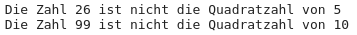
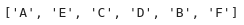

# Doppelklicken auf diesem Text und Ihren Namen eintragen


# Aufgabe 1: \[5 P\]

## Aufgabe 1.1

Erstellen Sie mittels einem Array (`produkte`) eine Einkaufsliste
bestehend aus 5 Produkten
`[Bananen, Nudeln, Butter, Zwiebeln, Klopapier]`, sowie eine Liste
(`preise`) mit den dazugehörigen Preisen `[1.9 1.2 2.3 0.8 2.5]`.

``` python
#Ihre Lösung hier eintippen:
produkte = ["Bananen", "Nudeln", "Butter", "Zwiebeln", "Klopapier"]
preise = [1.9, 1.2, 2.3, 0.8, 2.5]
preise = [1.9, 1.2, 2.3, 0.8, 2.5]
```

## Aufgabe 1.2

Geben Sie das 3. Element (=Butter) aus.

``` python
#Ihre Lösung hier eintippen:
print(produkte[2])
```

    Butter

## Aufgabe 1.3

Schreiben Sie das Programm, die das billigste und das teuerste Produkt
ausgibt.

``` python
#Ihre Lösung hier eintippen:
ind_billig = 0
ind_teuer = 0
for i in range(len(preise)):
    if preise[i] < preise[ind_billig]:
        ind_billig = i
    if preise[i] > preise[ind_teuer]:
        ind_teuer = i
print("Das billigste Produkt: ", produkte[ind_billig], preise[ind_billig], "€")
print("Das teuerste Produkt: ", produkte[ind_teuer], preise[ind_teuer], "€")
        
```

    Das billigste Produkt:  Zwiebeln 0.8 €
    Das teuerste Produkt:  Klopapier 2.5 €

# Aufgabe 2: \[3 P\]

Gegeben sei folgende Zahlenliste:
`quadrat_zahlen: [1, 4, 9, 16, 26, 36, 49, 64, 81, 99]`  
Schreiben Sie ein Programm, welches die fehlerhaften Quadratzahlen
findet.

> HINWEIS: `==` ist in python ein Vergleichsoperator *gleich*  
> `!=`ist in python ein Vergleichsoperator *ungleich*

**Erwartete Ausgabe:**

<figure>

<figcaption aria-hidden="true">image.png</figcaption>
</figure>

``` python
#Ihre Lösung hier eintippen:
quadrat_zahlen = [1, 4, 9, 16, 26, 36, 49, 64, 81, 99]
for i in range(len(quadrat_zahlen)):
    if quadrat_zahlen[i] != (i+1)**2:
        print("Die Zahl ", quadrat_zahlen[i], "ist nicht die Quadratzahl von", i+1)
```

    Die Zahl  26 ist nicht die Quadratzahl von 5
    Die Zahl  99 ist nicht die Quadratzahl von 10

# Aufgabe 3: \[3 P\]

Gegeben ist ein Array: `A, B, C, D, E, F` Schreiben Sie ein Programm,
welches das 2. Element (B) mit dem 5. Element (E) tauscht.

**Erwartete Ausgabe**

<figure>

<figcaption aria-hidden="true">image.png</figcaption>
</figure>

``` python
#Ihre Lösung hier eintippen:
vektor = ["A", "B", "C", "D", "E", "F"]
zw = vektor[1]
vektor[1] = vektor[4]
vektor[4] = zw
print(vektor)
```

    ['A', 'E', 'C', 'D', 'B', 'F']

# Aufgabe 4: \[4 P\]

Schreiben Sie ein Programm, welches ermittelt, wie viele Einträge in dem
Vektor größer als 0.5 sind.

`vektor = [ 0.9,  0.87,  0.09,  0.04,  0.8,  0.73,  0.49,  0.7, 0.39,  0.05,  0.84,  0.42,  0.3,  0.31,  0.88,  0.75,  0.97,  0.61,  0.75,  0.21,  0.13,  0.23,  0.39,  0.49, 0.03,  0.29,  0.88,  0.13,  0.44,  0.92,  0.05,  0.53, 0.8,  0.61,  0.19,  0.02,  0.35,  0.97,  0.07,  0.5, 0.43,  0.39,  0.06,  0.49,  0.37,  0.09]`

Von Hand zählen ist NICHT die richtige Lösung

``` python
#Ihre Lösung hier eintippen:
vektor = [ 0.9,  0.87,  0.09,  0.04,  0.8,  0.73,  0.49,  0.7, 
        0.39,  0.05,  0.84,  0.42,  0.3,  0.31,  0.88,  0.75,  
        0.97,  0.61,  0.75,  0.21,  0.13,  0.23,  0.39,  0.49,  
        0.03,  0.29,  0.88,  0.13,  0.44,  0.92,  0.05,  0.53,  
        0.8,  0.61,  0.19,  0.02,  0.35,  0.97,  0.07,  0.5,
        0.43,  0.39,  0.06,  0.49,  0.37,  0.09]
anzahl = 0
for i in range(len(vektor)):
    if vektor[i] > 0.5:
        anzahl = anzahl +1
print("Anzahl der Elemente größer als 0,5 = ", anzahl)
```

    Anzahl der Elemente größer als 0,5 =  17

\# Aufgabe 5: \[5 P\]

Sortieren Sie den Vektor aus der Aufgabe 4 **absteigend** mit der
BubbleSort-Methode.

``` python
#Ihre Lösung hier eintippen:
vektor = [ 0.9,  0.87,  0.09,  0.04,  0.8,  0.73,  0.49,  0.7, 
        0.39,  0.05,  0.84,  0.42,  0.3,  0.31,  0.88,  0.75,  
        0.97,  0.61,  0.75,  0.21,  0.13,  0.23,  0.39,  0.49,  
        0.03,  0.29,  0.88,  0.13,  0.44,  0.92,  0.05,  0.53,  
        0.8,  0.61,  0.19,  0.02,  0.35,  0.97,  0.07,  0.5,
        0.43,  0.39,  0.06,  0.49,  0.37,  0.09]

laenge = len(vektor)

#Sortieren
for i in range(1,laenge):
    for j in range(0,laenge-i):
        if vektor[j] < vektor[j+1]:
            zwischenspeicher = vektor[j]
            vektor[j] = vektor[j+1]
            vektor[j+1] = zwischenspeicher

#Ausgabe
print(vektor)
```

    [0.97, 0.97, 0.92, 0.9, 0.88, 0.88, 0.87, 0.84, 0.8, 0.8, 0.75, 0.75, 0.73, 0.7, 0.61, 0.61, 0.53, 0.5, 0.49, 0.49, 0.49, 0.44, 0.43, 0.42, 0.39, 0.39, 0.39, 0.37, 0.35, 0.31, 0.3, 0.29, 0.23, 0.21, 0.19, 0.13, 0.13, 0.09, 0.09, 0.07, 0.06, 0.05, 0.05, 0.04, 0.03, 0.02]
