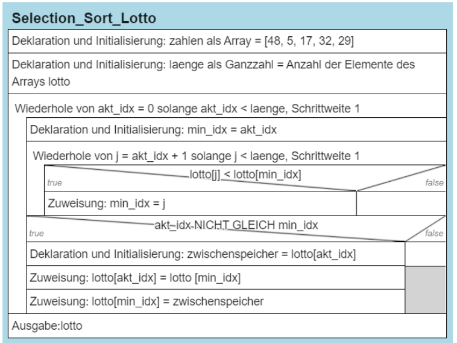

# Aufgabe 1: SelectionSort – Lottozahlen


Die Zahlen der aktuellen Lottoziehung liegen in der Reihenfolge der
Ziehung in einem Array lotto vor `[48, 5, 17, 32, 7, 29]` und sollen
noch sortiert werden. Sie erhalten den Auftrag, ein entsprechendes
Programm zu entwickeln, das die Lottozahlen mit Hilfe des
Sortieralgorithmus ‘Selection Sort’ sortiert und die sortierten Zahlen
in der Konsole ausgibt.

``` python
lotto= [48, 5, 17, 32, 7, 29]

laenge = len(lotto)
for akt_idx in range(laenge-1):
    min_idx = akt_idx
    for j in range(akt_idx + 1, laenge):
        #Suche nach der niedrigsten Zahl
        if lotto[j] < lotto[min_idx]:
            min_idx = j
    #Tausch
    zwischenspeicher = lotto[akt_idx]
    lotto[akt_idx] = lotto [min_idx]
    lotto[min_idx] = zwischenspeicher

#Ausgabe
print(lotto)
```

<figure>

<figcaption aria-hidden="true">image.png</figcaption>
</figure>
