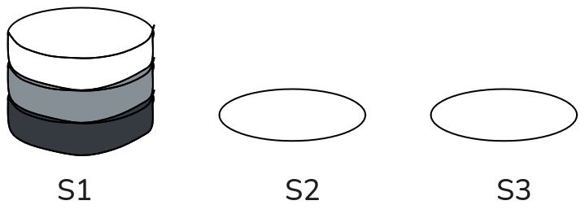
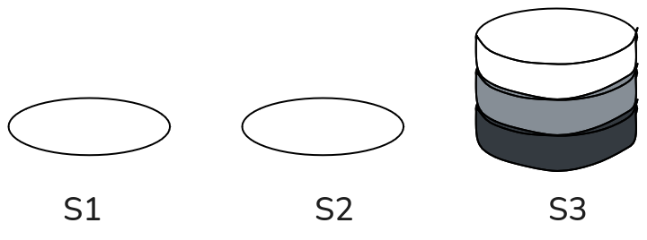

# Aufgabe: Stapelspeicher-Spiel

Bei einem Spiel müssen alle drei Scheiben des linken Stapelplatzes
**S1** auf den rechten Stapelplatz **S3** übertragen werden, wie unten
dargestellt.

## Anfangszustand:

<figure>

<figcaption aria-hidden="true">image.png</figcaption>
</figure>

## Endzustand:

<figure>

<figcaption aria-hidden="true">image-2.png</figcaption>
</figure>

## Regeln:

1.  Die Scheiben können nur nach dem Prinzip **„Stapelspeicher“** bewegt
    werden (LIFO: Last In, First Out).
2.  Die Scheiben dürfen auf alle drei Stapelplätze **S1**, **S2** und
    **S3** gelegt werden.
3.  Es kann nur **eine Scheibe pro Zug** verschoben werden.
4.  **Eine dunklere Scheibe darf nicht auf einer helleren Scheibe**
    liegen.

## Beispiel für einen Zug:

S1: pop(), S2: push() \> Vom Stapelplatz **S1** wird eine Scheibe
entnommen und auf den Stapelplatz **S2** gelegt.

## Aufgabe:

Überführen Sie die Scheiben schrittweise unter Verwendung der Befehle
`pop()` und `push()` vom **Anfangszustand** in den **Endzustand**.

# Aufgabe: Palettenlager

Ein Großhändler lagert Waren palettenweise in einem Lager namens
**„Palettenlager“**. Das Lager ist so organisiert, dass die Einlagerung
und Entnahme von Paletten nur nach dem **LIFO-Prinzip** (Last In, First
Out) möglich ist.

Im Stapelspeicher `palettenlager` werden die Bestände und
Bestandsveränderungen gespeichert. Dafür stehen zwei Operationen zur
Verfügung:

-   **Einlagerung:** `palettenlager.push(Anzahl)` \> Es werden `Anzahl`
    Paletten in das Lager `palettenlager` eingelagert.

-   **Entnahme:** `palettenlager.pop(Anzahl)` \> Es werden `Anzahl`
    Paletten aus dem Lager `palettenlager` entnommen.

Das Lager ist am **01.03.2025** leer, d. h. der Lagerbestand beträgt 0.

## Bestandsveränderungen im März 2025:

<table>
<thead>
<tr class="header">
<th>Datum</th>
<th>Befehl</th>
</tr>
</thead>
<tbody>
<tr class="odd">
<td>03.03.2025</td>
<td><code>palettenlager.push(60)</code></td>
</tr>
<tr class="even">
<td>07.03.2025</td>
<td><code>palettenlager.pop(20)</code></td>
</tr>
<tr class="odd">
<td>10.03.2025</td>
<td><code>palettenlager.push(40)</code></td>
</tr>
<tr class="even">
<td>15.03.2025</td>
<td><code>palettenlager.pop(50)</code></td>
</tr>
<tr class="odd">
<td>20.03.2025</td>
<td><code>palettenlager.push(80)</code></td>
</tr>
<tr class="even">
<td>25.03.2025</td>
<td><code>palettenlager.pop(30)</code></td>
</tr>
</tbody>
</table>

------------------------------------------------------------------------

### Aufgaben:

#### 1. Lagerbestand am 31.03.2025

Berechnen Sie den Lagerbestand am 31.03.2025.

#### 2. Höchster Lagerbestand im März

Ermitteln Sie den höchsten Lagerbestand im März 2025.

#### 3. Verfügbarkeit der Lieferung vom 10.03.2025

Beschreiben Sie, wann die Paletten aus der Lieferung vom **10.03.2025**
nicht mehr im Lager vorhanden sind.
