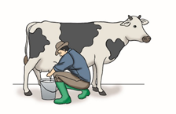
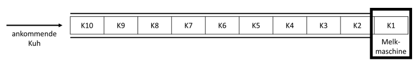
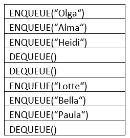
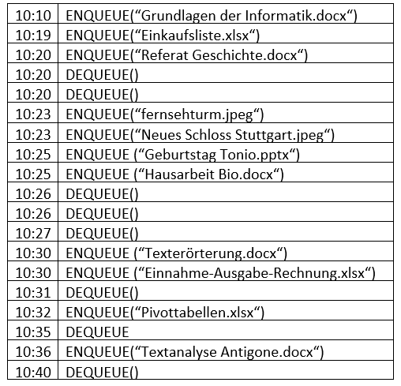

# Dynamische Datenstrukturen: Übung Warteschlange

## Aufgabe 1: Bauer Anton

<figure>

<figcaption aria-hidden="true">image.png</figcaption>
</figure>

Auf dem Bauernhof von Bauer Anton gibt es viele Milchkühe. Das Melken
der Kühe auf dem Bauern¬hof übernimmt eine Melkmaschine, die immer eine
Kuh melken kann. Damit die Daten wie bspw. Literan-zahl, Qualität usw.
gespeichert werden können, tragen die Kühe Chips an einem Halsband. Jede
Kuh kann selbst entscheiden, wann sie gemolken wird. Das folgende
Schaubild zeigt diesen Vorgang:

<figure>

<figcaption aria-hidden="true">image.png</figcaption>
</figure>

Jede ankommende Kuh wird mit der Operation `ENQUEUE(“name“)` der
Warteschlange der Melkma-schine hinzugefügt. Ist eine Kuh fertig
gemolken, wird sie mit der Operation `DEQUEUE()` aus der Warteschlange
entfernt. Folgender Algorithmus zeigt einen Melkvorgang zu einem
bestimmten Zeitpunkt.

<figure>

<figcaption aria-hidden="true">image.png</figcaption>
</figure>

### Aufgabe 1.1:

Welche Kühe wurden bereits gemolken?

### Aufgabe 1.2:

Welche Kuh wird gerade gemolken?

### Aufgabe 1.3:

Wie viele Kühe müssen noch gemolken werden?

# Aufgabe 2: Netzwerkdrucker

Ein Netzwerkdrucker erhält im Zeitraum von 10:00 bis 11:00 Uhr mehrere
Druckaufträge, die in einer Warteschlange erfasst werden. Die
nachfolgende Auflistung zeigt die Eingänge der Druckaufträge und deren
Ausführung:

<figure>

<figcaption aria-hidden="true">image.png</figcaption>
</figure>

## Aufgabe 2.1:

Welche Dokumente werden um 10:26 gedruckt? (Reihenfolge beachten!)

## Aufgabe 2.2:

Wann wird das Dokument “Neues Schloss Stuttgart.jpeg“ gedruckt?-

## Aufgabe 2.3:

Welches Dokument wird um 10:31 gedruckt?

## Aufgabe 2.4:

Um 10:34 fällt der Netzwerkdrucker wegen eines Defekts aus. Welche
Dokumente befinden sich zu diesem Zeitpunkt in der Warteschlage des
Netzwerkdruckers?
